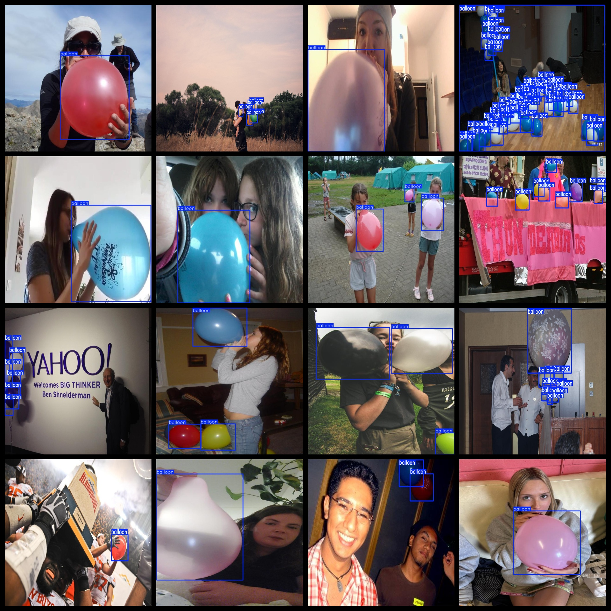
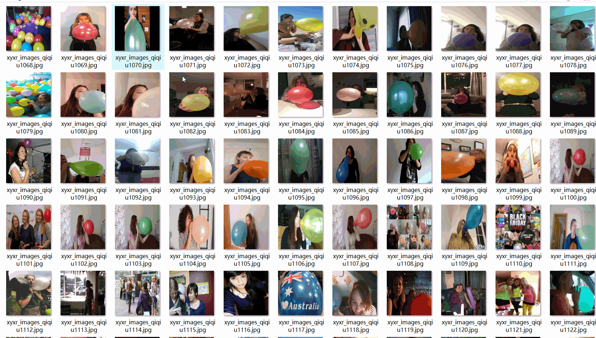

# Balloon Dataset 2291 imagesVOC+YOLO format

The balloon dataset consists of 2291 images in the VOC+YOLO format. The dataset is organized into three folders: JPEGImages, Annotations, and labels.

In the JPEGImages folder, there are a total of 2291 jpg images.

In the Annotations folder, there are a total of 2291 xml files.

In the labels folder, there are a total of 2291 txt files.

There is only one label category: "balloon". The number of boxes (yolo format) for each category is as follows:

- Balloon boxes = 9909
- Total boxes = 9909

The resolution of the images is clear.

The images have not been enhanced.

The GitHub repository location is: datasets_sl

The shape of the labels is rectangular boxes, used for target detection recognition.

Important Note: There is no guarantee for the accuracy or reasonableness of the training model or weight files. The dataset only provides accurate and reasonable annotations.

The annotation and image situation is as follows:

## Images

---

Here is a pay link on Stripe (https://buy.stripe.com/3cs8yP7sY87d0vu9AB). Please contact me lonlonago@foxmail.com after funding $89, and I will send you a complete data files, thank you!

